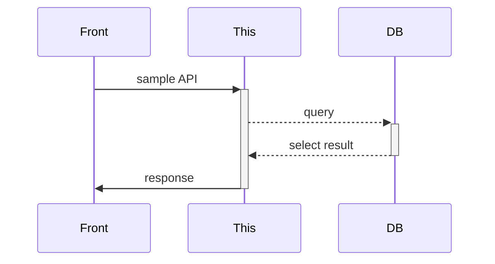
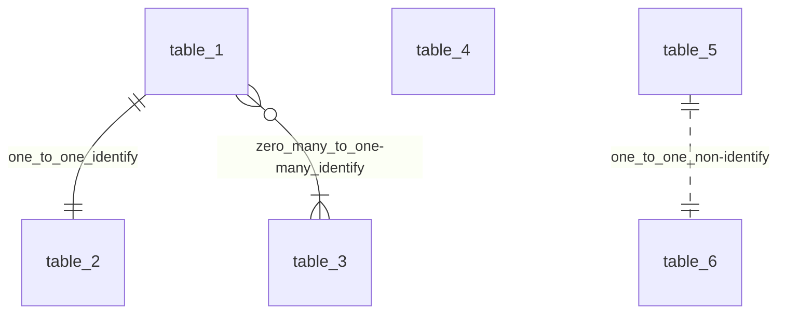
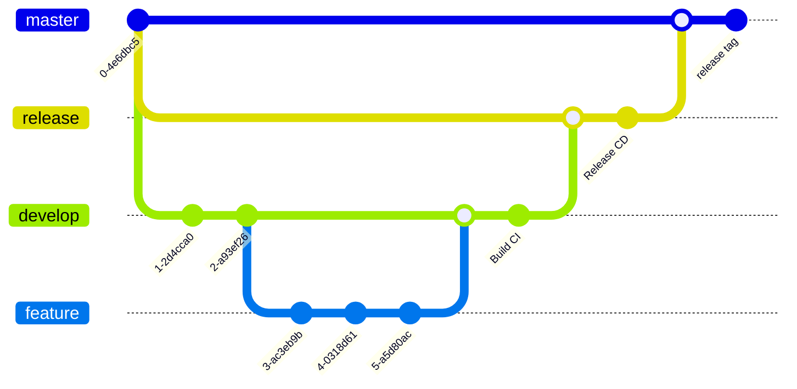

> [!Caution]
> This `README.md` is created for sample repository, should modify for new one.
> Please substitute :%s/sample-template-repository/collect_name/g

[](https://github.com/serna37/sample-template-repository/releases/tag/v0.0.3)

[](https://github.com/serna37/sample-template-repository/actions/workflows/build.yml)
[](https://github.com/serna37/sample-template-repository/actions/workflows/deploy.yml)
[](https://github.com/serna37/sample-template-repository/actions/workflows/cron.yml)
[](https://github.com/serna37/sample-template-repository/actions/workflows/tag_release.yml)

# sample-template-repository
<!-- Description -->
This repository is `some description`.

- App Profile
<!-- Badges -->
<table>
  <tr>
    <td>License</td>
    <td>Env</td>
    <td>Lang</td>
    <td>DB</td>
    <td>Editor</td>
  </tr>
  <tr>
    <td>
      <a href="./LICENSE">
        
      </a>
    </td>
    <td>
      
      
      
      <br>
      
      
    </td>
    <td>
      
      
      <br>
      
      
      
      
      
      <br>
      
      
      
      
      <br>
      
      
      
      <br>
      
      
      
      
      <br>
      
      
      
    </td>
    <td>
      
      
      
    </td>
    <td>
      
    </td>
  </tr>
</table>

- [Author Profile](https://github.com/serna37)

---

# OVER VIEW
## File Tree
<!-- file tree -->
<a href="https://tree.nathanfriend.io/">
  
</a>

```
.
├── core/
│   ├── some
│   ├── file
│   └── ishere
├── components/
│   └── *.js   to describe some
├── some/
│   ├── somefile
│   └── somefile.js
└── index.html
```

## Sequence
<!-- mermaid -->
<a href="https://mermaid-js.github.io/mermaid-live-editor/edit#pako:eNpVjstqw0AMRX9FaNVC_ANeFBq7zSbQQrPzZCFsOTMk80CWCcH2v3ccb1qtxD3nCk3Yxo6xxP4W760lUTjVJkCe96ay4gb1NJyhKN7mAyv4GPgxw_7lEGGwMSUXLq-bv18lqKbjqjGodeG6bKh69r8Cz1A3R0oa0_kvOd3jDB-N-7b5_H9ihXPrs-mp7KloSaAieSq4Q8_iyXX5_WlNDKplzwbLvHYkV4MmLNmjUePPI7RYqoy8wzF1pFw7ugj5LVx-AfLqVWg">
  
</a>



## API IF
|status|method|endpoint|feature|remarks|
|--|--|--|--|--|
|<ul><li>[ ] </ul>|`POST`|`/app`|some description|some remarks|
|<ul><li>[x] </ul>|`GET`|`/app/test`|some description|some remarks|

## ER
<!-- mermaid -->
<a href="https://mermaid-js.github.io/mermaid-live-editor/edit#pako:eNpVjstqw0AMRX9FaNVC_ANeFBq7zSbQQrPzZCFsOTMk80CWCcH2v3ccb1qtxD3nCk3Yxo6xxP4W760lUTjVJkCe96ay4gb1NJyhKN7mAyv4GPgxw_7lEGGwMSUXLq-bv18lqKbjqjGodeG6bKh69r8Cz1A3R0oa0_kvOd3jDB-N-7b5_H9ihXPrs-mp7KloSaAieSq4Q8_iyXX5_WlNDKplzwbLvHYkV4MmLNmjUePPI7RYqoy8wzF1pFw7ugj5LVx-AfLqVWg">
  
</a>



---

# Usage
## 基本運用
- どうたらする
- どうたらする
- どうたらする

## メンテ作業
- `test.js`へ関数追加
- ブランチ`release`へPR、マージ

---

# Development
## Branch
> [!Important]
> *Branch Rule*
> - develop (default): to develop.
> - release: for deploy server and publish. PR `[release <- develop]`
> - master: for fix. PR `[master <- release]` with update `tag badge` on README

<!-- mermaid -->
<a href="https://mermaid-js.github.io/mermaid-live-editor/edit#pako:eNpVjstqw0AMRX9FaNVC_ANeFBq7zSbQQrPzZCFsOTMk80CWCcH2v3ccb1qtxD3nCk3Yxo6xxP4W760lUTjVJkCe96ay4gb1NJyhKN7mAyv4GPgxw_7lEGGwMSUXLq-bv18lqKbjqjGodeG6bKh69r8Cz1A3R0oa0_kvOd3jDB-N-7b5_H9ihXPrs-mp7KloSaAieSq4Q8_iyXX5_WlNDKplzwbLvHYkV4MmLNmjUePPI7RYqoy8wzF1pFw7ugj5LVx-AfLqVWg">
  
</a>



## PR
- 現在のブランチから`develop`へPR -> Actions: ビルド
```shell
gh pr create --base develop --head $(git branch --contains | cut -d " " -f 2) --title "modify" --body ""
```

- リリース公開用PR -> Actions: デプロイ
```shell
gh pr create --base release --head develop --title "Publish" --body ""
```

- レポジトリtag-release用PR -> Actions: タグリリース
```shell
gh pr create --base master --head release --title "Relese" --body ""
```

- PRをブラウザで開く (sample #10)
```shell
gh browse 10
```

## Commands
- Python仮想環境を設定
```shell
python -m venv .
```

- 仮想環境を起動
```shell
. bin/activate
```

- pip install
```shell
pip install -r requirements.txt
```

- 仮想環境を終了
```shell
deactivate
```

---

# Build & Deploy
## Util
- コンテナ停止 + 削除 (コンテナ名重複を防ぐ)
```shell
docker stop $(docker ps -aq -f name=NAME)
docker rm $(docker ps -aq -f name=NAME)
```

- 停止コンテナ全削除 + <none>イメージ全削除
```shell
docker container prune
docker rmi $(docker images -f "dangling=true" -q)
```

## Local
- ローカルサーバ起動
```shell
sh deploy.sh && lazydocker
```

- コマンド内容
```shell
docker build -t IMAGENAME:latest . \
  && docker run \
    --name NAME \
    -d \
    -p 8080:8080 \
    -v "$(pwd)/../MOUNT:/asset/DB" \
    NAME:latest
```

## Remote
- リリースと事前準備
  - `release`ブランチへのPRマージで、`Github Actions`からデプロイ。
  - https://github.com/serna37/sample-template-repository/actions

> [!Note]
> - `GitHub Actions`でSSH接続する場合`シークレット`が必要。([ref](https://qiita.com/0622okakyo/items/5295b7b13daf3c35b3e1))
> - https://github.com/serna37/{レポジトリ名}/settings/secrets/actions
> - `README.md`のバッチ等で`workflow`の成功を確認 ※ブランチに注意する

```shell
gh secret set HOST --body 'neras-sta.com'
gh secret set PORT --body '22'
gh secret set USERNAME --body 'some value'
gh secret set PASSWORD --body 'some value'
gh secret set MAIL_HOST --body 'smtp.gmail.com'
gh secret set MAIL_PORT --body '465'
gh secret set MAIL_USERNAME --body 'some value'
gh secret set MAIL_PASSWORD --body 'some value'
gh secret set MAIL_FROM --body 'some value'
gh secret set MAIL_TO --body 'some value'
```

<details>

<summary>サーバ側の事前準備</summary>

### サーバ側でクローン後、認証不要に
`$GITHUB_TOKEN`はGitHubログインのトークン。
```shell
git remote set-url origin https://$GITHUB_TOKEN@github.com/{ユーザ}/{レポジトリ名}.git
```

### ポートのプロセスを確認
```shell
lsof -P -i:8080
kill {PID}
```

### リバプロ追加
- `su`して実行
```shell
vim /etc/httpd/conf/httpd.conf
```
```vim
syntax on | set number laststatus=2 showtabline=2 incsearch hlsearch ignorecase smartcase shortmess-=S
```

- 設定追加
```xml
<Location /PATH>
  ProxyPass http://localhost:8080
  ProxyPassReverse http://localhost:8080
</Location>
```

- apache再起動
```shell
systemctl restart httpd
```

</details>

---

# Note
- dockerでsudoしなくていい設定 ([ref](https://qiita.com/DQNEO/items/da5df074c48b012152ee))
```shell
# dockerグループがなければ作る
sudo groupadd docker

# 現行ユーザをdockerグループに所属させる
sudo gpasswd -a $USER docker

# dockerデーモンを再起動する (CentOS7の場合)
sudo systemctl restart docker

# exitして再ログインすると反映される。
exit
```

- dockerデーモンの権限がない場合 (Docker for Desktopで確認)
```shell
sudo chown -R $(whoami) ~/.docker
```

- GitHub ActionsからGmail送信の準備 (2段階認証、アプリパスワード作成)<br>
https://zenn.dev/nakamura196/articles/789122b57d595b
